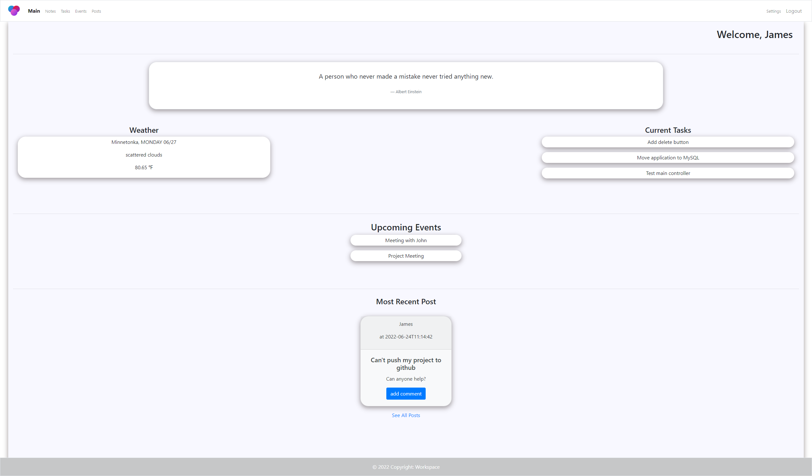
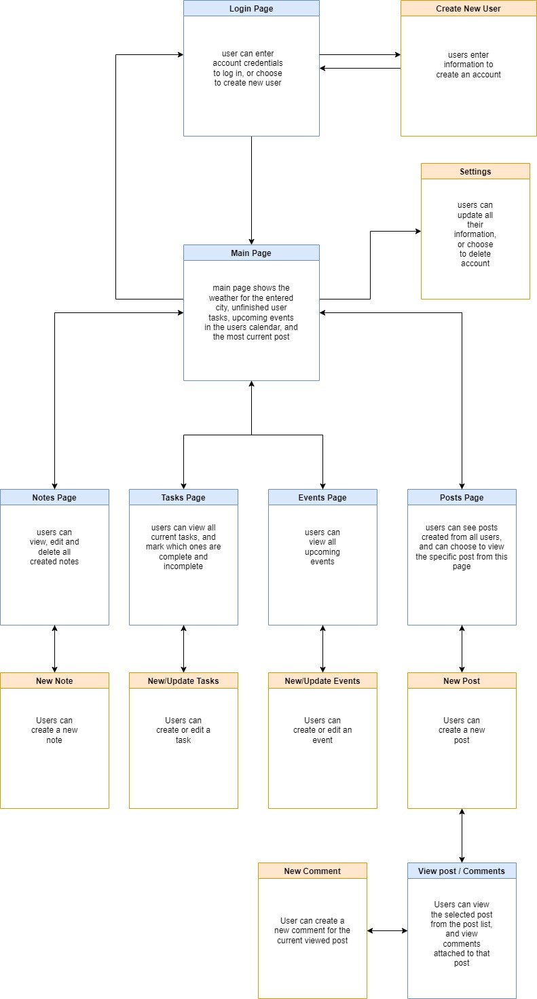
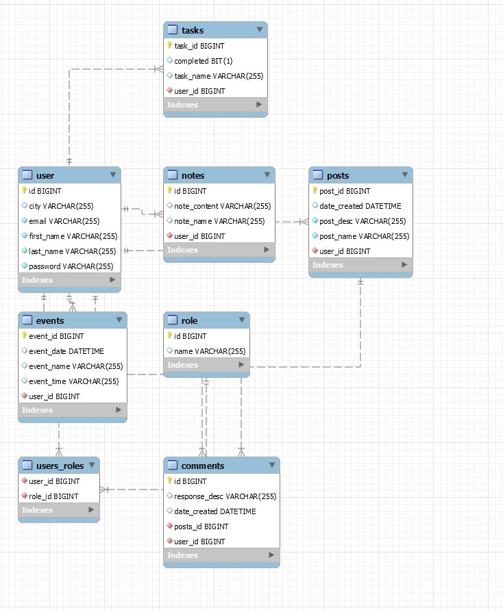

# Workspace

## About Workspace
Workspace is an easy to use management system. Once a user registers with the application, they are offered a variety of tools to help organize and plan their projects. Users are able to create and edit multiple notes, tasks, and upcoming events. The main page of the application serves as an easy to access place to organize thoughts and map out daily activities. Additionally users can post questions and topics that anyone can comment on. With multiple posts and ongoing conversations relating to project ideas, this application also serves as a great resource when reaching out to other developers.
## Wireframe

## Database Diagram

## Built With
- Java 11
- Spring
- MySQL
- HTML 5
- CSS
- JavaScript
- Thymeleaf
- Lombok
- JUNIT 5
- Mockito