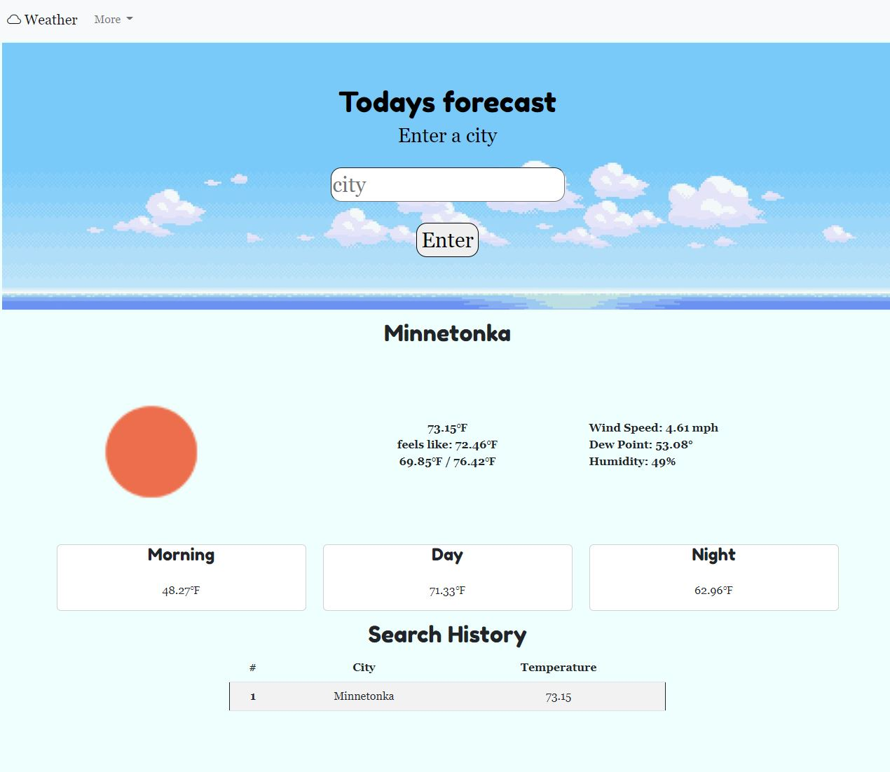

# Forecast Checker

## About the Project
Forecast checker is a website dedicated to simply checking the forecast. Once the user inputs a city, the website will generate the forecast for the given city. They can choose to generate a forecast for the given time, an 24 hour forecast for the day, or a general 6 day forecast.

## Built With
HTML\
css\
javascript\
AJAX\
bootstrap